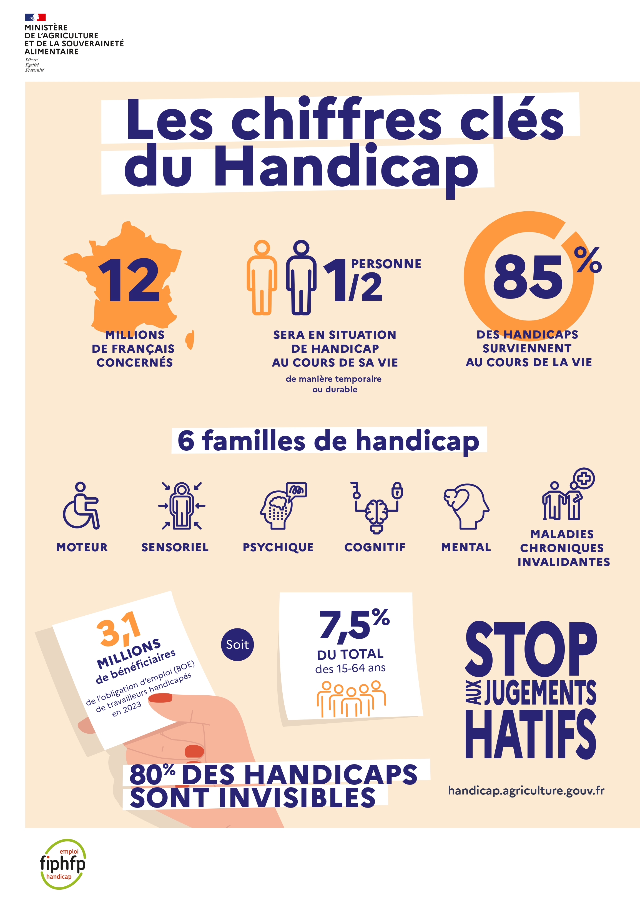
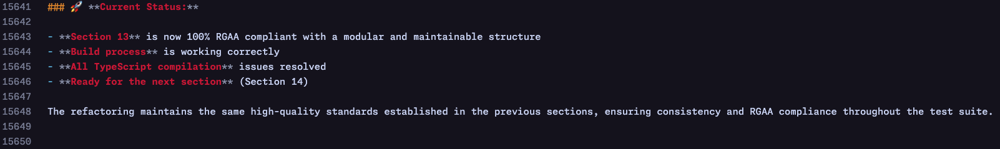

<!-- markdownlint-disable MD001 MD022 MD025 MD026 MD033 MD036 MD049 MD042 -->

# “a11y” : aïe aïe aïe ?!

## Démystifier l'accessibilité <br/> pour améliorer nos produits

<div class="fragment flex" style="justify-content: center !important;">
  <a href="https://lyonjs.org/" title="LyonJS" style="margin-right: 0 !important;">
    
  </a>
  <em style="margin-left: 0 !important;">×</em>
  <a href="https://indy.fr" title="Indy.fr">
    
  </a>
  <em> — </em>
  <em>15/10/2025</em>
</div>

^^^

### 👉 retour d'expérience & morceaux de code choisis

## par Virgil ROGER
_dev JS full-stack @Indy depuis 2019_ <!-- .element: class="fragment" -->

---

# A <!-- .element: class="slide_header-number" -->

Notes:

- Qui ici me voit & m'entend bien ?
  - éteindre lumière + micro
- Qui maintenant me voit & m'entend bien ?

^^^

# Le petit ~Roger~ Robert

> L’accessibilité numérique consiste à rendre les **contenus** et **services** numériques **compréhensibles et utilisables** par les personnes en situation de handicap.
>
> https://accessibilite.numerique.gouv.fr
<!-- .element: class="fragment" -->

---

# _____________ ?

<div class="r-stack">
  <pre class="fragment">
    <code class="language-plaintext">
      +---+
      |   |
          |
          |
          |
          |
    =========
    </code>
  </pre>

  <pre class="fragment">
    <code class="language-plaintext">
      +---+
      |   |
      O   |
          |
          |
          |
    =========
    </code>
  </pre>

  <pre class="fragment">
    <code class="language-plaintext">
      +---+
      |   |
      O   |
      |   |
          |
          |
    =========
    </code>
  </pre>

  <pre class="fragment">
    <code class="language-plaintext">
      +---+
      |   |
      O   |
     /|   |
          |
          |
    =========
    </code>
  </pre>

  <pre class="fragment">
    <code class="language-plaintext">
      +---+
      |   |
      O   |
     /|\  |
          |
          |
    =========
    </code>
  </pre>

  <pre class="fragment">
    <code class="language-plaintext">
      +---+
      |   |
      O   |
     /|\  |
     /    |
          |
    =========
    </code>
  </pre>  
  <pre class="fragment">
    <code class="language-plaintext">
      +---+
      |   |
      O   |
     /|\  |
     / \  |
          |
    =========
    </code>
  </pre>
</div>

Notes:

-> on va faire un pendu
-> A(11 lettres)Y
-> A11y === ally === allié

^^^

# ACCESSIBILITY

---

# “Je ne suis pas validiste*...

_*j'ai un ami qui utilise IE”_ <!-- .element: class="fragment" -->

Notes:

- 28% des français déclarés [source](https://drees.solidarites-sante.gouv.fr/publications-communique-de-presse-documents-de-reference/panoramas-de-la-drees/241128_Panorama_Handicap2024)
- 8.1% reconnus professionnellement [source](https://handicap.force-ouvriere.org/tour-dhorizon-du-handicap/quelques-chiffres)
- 80% invisible [source](https://handicap.force-ouvriere.org/tour-dhorizon-du-handicap/quelques-chiffres)

^^^

# Un bon tiers

> En 2022 en France métropolitaine, **14,5 millions** de personnes de 15 ans ou plus (**28 %**) vivant à domicile déclarent avoir au moins une limitation fonctionnelle sévère (...)
<!-- .element: class="fragment" -->

[source gouv.fr](https://drees.solidarites-sante.gouv.fr/publications-communique-de-presse-documents-de-reference/panoramas-de-la-drees/241128_Panorama_Handicap2024) <!-- .element: class="fragment" -->

^^^

# Ouvrir les yeux

> **80 %** des personnes disposant d’une reconnaissance administrative d’un handicap présentent un handicap invisible.
>
<!-- .element: class="fragment" -->

[source FO](https://handicap.force-ouvriere.org/tour-dhorizon-du-handicap/quelques-chiffres)
<!-- .element: class="fragment" -->

^^^

# Revoir ses acquis

> Seuls **15 %** des handicaps le sont à la naissance :
>
> 👉 **85 %** sont acquis au cours de la vie.
<!-- .element: class="fragment" -->

[source gouv.fr](https://handicap.agriculture.gouv.fr/chiffres-cles-sur-le-handicap-a284.html)
<!-- .element: class="fragment" -->

Notes:

- le handicap n'est que très rarement inné
  - "Seuls 15 % des handicaps le sont à la naissance : 85 % sont acquis au cours de la vie." [source](https://handicap.force-ouvriere.org/tour-dhorizon-du-handicap/quelques-chiffres)

---

# C'est une bonne situation ça, handicap ?

^^^

> Le handicap est défini comme :
>
> “(...) toute limitation d’activité ou restriction de participation à la vie en société subie dans son environnement par une personne en raison d’une altération substantielle, durable ou définitive d’une ou plusieurs fonctions physiques, sensorielles, mentales, cognitives ou psychiques, d’un polyhandicap ou d’un trouble de santé invalidant”

[à vos souhaits !](https://accessibilite.numerique.gouv.fr/obligations/notions-accessibilite-numerique/)
<!-- .element: class="fragment" -->

^^^

<div class="r-stack">
  <div>
  
  > “(...) toute limitation d’activité ou restriction de participation à la vie en société subie dans son environnement par une personne en raison d’une altération substantielle, durable ou définitive d’une ou plusieurs fonctions physiques, sensorielles, mentales, cognitives ou psychiques, d’un polyhandicap ou d’un trouble de santé invalidant”

  </div>
  <div class="fragment">

  > “(...) toute limitation d’activité ou restriction de **participation à la vie en société** subie dans son environnement par une personne en raison d’une altération substantielle, durable ou définitive d’une ou plusieurs fonctions physiques, sensorielles, mentales, cognitives ou psychiques, d’un polyhandicap ou d’un trouble de santé invalidant”

  </div>
  <div class="fragment">

  > “(...) toute limitation d’activité ou restriction de **participation à la vie en société** subie dans son **environnement** par une personne en raison d’une altération substantielle, durable ou définitive d’une ou plusieurs fonctions physiques, sensorielles, mentales, cognitives ou psychiques, d’un polyhandicap ou d’un trouble de santé invalidant”

  </div>

  <div class="fragment">

  > “(...) toute limitation d’activité ou restriction de **participation à la vie en société** subie dans son **environnement** par une personne en raison d’une altération substantielle, **durable ou définitive** d’une ou plusieurs fonctions physiques, sensorielles, mentales, cognitives ou psychiques, d’un polyhandicap ou d’un trouble de santé invalidant”
  
  </div>

  <div class="fragment">

  > “(...) toute limitation d’activité ou restriction de **participation à la vie en société** subie dans son **environnement** par une personne en raison d’une altération substantielle, **durable ou définitive** d’une ou plusieurs fonctions **physiques, sensorielles, mentales, cognitives ou psychiques**, d’un polyhandicap ou d’un trouble de santé invalidant”
  
  </div>
</div>

Notes:

/!\ handicapé !== fauteuil roulant électrique

^^^


_You get a disability,_<!-- .element: class="fragment" data-fragment-index="1" -->

_and you get a disability,_<!-- .element: class="fragment" data-fragment-index="2" -->

_and YOU get a disability,_<!-- .element: class="fragment" data-fragment-index="3" -->

_everyone gets a disability!!_<!-- .element: class="fragment" data-fragment-index="4" -->

Notes:

- lunettes
- gants
- 2G
- RTL

^^^

# Oui, toi aussi.

> Une personne sur deux connaîtra dans sa vie une situation de handicap, durable ou réversible.
<!-- .element: class="fragment" -->

[source gouv.fr](https://handicap.agriculture.gouv.fr/chiffres-cles-sur-le-handicap-a284.html)
<!-- .element: class="fragment" -->

^^^

# État des lieux de sortie

[]() <!-- .element: class="fragment blurred" data-modal-type="image" -->

---

# [RGAA 4](https://accessibilite.numerique.gouv.fr/) vs
# [WCAG 2](https://www.w3.org/WAI/standards-guidelines/wcag/fr) vs
# [BSP](https://fne.asso.fr/actualites/proposition-de-loi-duplomb-toxique-pour-l-agriculture-l-environnement-et-la-sante)*

_*Bon Sens Paysan_ <!-- .element: class="fragment" -->

Notes:

- Référentiel Général d'Amélioration de l'Accessibilité
- Web Content Accessibility Guidelines

- convention
- pour les robots mais pas que
- importance fondamentale de la sémantique
  - origine du web
- pas des règles, ni une fin en soi

-> par définition infini

^^^

# Accessible ?

- perceptible <!-- .element: class="fragment" -->
- utilisable <!-- .element: class="fragment" -->
- compréhensible <!-- .element: class="fragment" -->
- robuste <!-- .element: class="fragment" -->

Notes:

-> mieux à tous les niveaux, même pour une personne valide
=> métrique de qualité produit, pas surcouche optionnelle

exemples :

- créer un contenu qui puisse être présenté de différentes manières sans perte d’information ni de structure
- laisser à l’utilisateur suffisamment de temps pour lire et utiliser le contenu
- faire en sorte que les pages fonctionnent de manière prévisible
- optimiser la compatibilité avec les utilisations actuelles **et futures**

^^^

# Très cher papa Noël...

_[... voici ma petite liste]()_ <!-- .element: class="fragment" data-modal-type="image" data-modal-url="../assets/rgaa.png" -->

^^^

# Zoom in & enhance !

[Chaque image porteuse d’information a-t-elle une alternative textuelle ?](https://accessibilite.numerique.gouv.fr/methode/criteres-et-tests/#1.1) <!-- .element: class="fragment" -->

```markdown
Chaque image (balise `` ou balise possédant l’attribut WAI-ARIA `role="img"`)
porteuse d’information a-t-elle une alternative textuelle ?

  1. Retrouver dans le document les images structurées au moyen d’un élément ``
  ou d’un élément possédant l’attribut WAI-ARIA `role="img"`;
  2. Pour chaque image, déterminer si l’image est porteuse d’information;
  3. Dans le cas où il s’agit d’un élément ``,
  vérifier que l’image est pourvue au moins d’une alternative textuelle parmi les suivantes :
      - Passage de texte associé via l’attribut WAI-ARIA aria-labelledby ;
      - Contenu de l’attribut WAI-ARIA aria-label ;
      - Contenu de l’attribut alt ;
      - Contenu de l’attribut title.
  4. Dans le cas où il s’agit d’un élément possédant l’attribut WAI-ARIA role="img",
  vérifier que l’image est pourvue au moins d’une alternative textuelle parmi les suivantes :
    - Passage de texte associé via l’attribut WAI-ARIA aria-labelledby ;
    - Contenu de l’attribut WAI-ARIA aria-label.
  5. Si au moins une alternative textuelle est trouvée, le test est validé.
```
<!-- .element: class="fragment" -->

---

# "Dura" lex

## (sed lex)

^^^

# Ça fera 50 000€ svp

_[perso je les ai pas](https://www.legifrance.gouv.fr/loda/id/JORFTEXT000000809647)_ 😅
<!-- .element: class="fragment" -->

Notes:

/!\ Amende absolument anecdotique pour n'importe quelle grande structure 

-> législation "peu" dissuasive et c'est rien de le dire...

^^^

# Obligation de moyens

[nos meilleurs efforts](https://fr.wikipedia.org/wiki/Obligation_de_moyens)
<!-- .element: class="fragment" -->

Notes:

Aucune condition de résultat pour l'instant

-> législation insuffisante.

---

# Vous avez dit audit ?

Un échantillon fiable & représentatif
<!-- .element: class="fragment" -->

Notes:

Échantillon

- page d’accueil;
- page contact;
- page mentions légales;
- page « accessibilité »;
- page plan du site;
- page d’aide;
- page d’authentification;

plus :

- au moins une page pertinente pour chaque type de service fourni et toute autre utilisation principale prévue;
- au moins un document téléchargeable pertinent;
- l’ensemble des pages constituant un processus;
- des exemples de pages ayant un aspect sensiblement distinct ou présentant un type de contenu différent;

plus :

- des pages sélectionnées au hasard représentant au moins 10 % des pages de l’échantillon;

^^^

# La douloureuse

> - <small>**« Totalement conforme »** si tous les critères de contrôle du RGAA sont respectés</small>
>
> - <small>**« Partiellement conforme »** si au moins 50 % des critères de contrôle du RGAA sont respectés</small>
>
> - <small>**« Non conforme »** s’il n’existe aucun résultat d’audit en cours de validité permettant de mesurer le respect des critères ou si moins de 50 % des critères de contrôle du RGAA sont respectés.</small>

---

# B <!-- .element: class="slide_header-number" -->

^^^

# Bon, et ce JS alors ?

_qu'on n'est pas venu·e·s là pour pas coder, OK ?!_ <!-- .element: class="fragment" -->

<small class="fragment">
(oui je sais, on est là pour les pizzas)
</small>

---

# Je vais sûrement pas le faire deux fois...

_Un·e bon dev est un·e dev fénéant·e_ <!-- .element: class="fragment" -->

(Confucius; NDLR) <!-- .element: class="fragment" -->

Notes:

- CI/CD
  -> importance de l'automatisation et de la non-régression
  -> réponse valide à l'obligation de moyens
- Mise en évidence des trous dans la raquette :
  - checks manuels parfois nécessaires
    - gros potentiel sur les LLMs pour ces tests précis
  - difficulté de tester le nouveau code in-situ sans parcourir 100% de l’app à chaque fois (couteux)
    - priorité de certaines routes par rapport à d’autres

---

# B-A-BA du test E2E

_Ça en fait des majuscules..._ <!-- .element: class="fragment" -->

Notes:

- Cypress
- Playwright
- Storybook

^^^

# Éléments de langage

```typescript [2-3|4|6|10|16]
// https://docs.cypress.io/app/end-to-end-testing/writing-your-first-end-to-end-test#Step-4-Make-an-assertion
describe('My First Test', () => {
  it('Gets, types and asserts', () => {
    cy.visit('https://example.cypress.io')

    cy.contains('type').click()

    // Should be on a new URL which
    // includes '/commands/actions'
    cy.url().should('include', '/commands/actions')

    // Get an input, type into it
    cy.get('.action-email').type('fake@email.com')

    //  Verify that the value has been updated
    cy.get('.action-email').should('have.value', 'fake@email.com')
  })
})
```

^^^

# Mon royaume pour `cy.a11y()`

---

# Sur le terrain

_passe décisive de [Axe-Core](https://github.com/dequelabs/axe-core)_ <!-- .element: class="fragment" -->

^^^

```ts
/**
 * Runs axe-core analysis
 */
export function runAxeScan(): Cypress.Chainable<A11yViolation[]> {
  cy.window().then((win: any) => {
    // npm install axe-core --save-dev
    return win.axe.run();
  }).then((results: any) => {
    results.violations.forEach((violation: any) => {
      // (...)
    });
  });
// (...)
}
```

---

# There's a cypress command for that!

^^^

```typescript [1-3|5-7|17-20]
// Test image accessibility
cy.rgaa_1_1_1(); // RGAA 1.1.1 - Chaque image (balise  ou balise possédant l'attribut WAI-ARIA role="img") porteuse d'information a-t-elle une alternative textuelle ?
cy.rgaa_1_2_1(); // RGAA 1.2.1 - Chaque image de décoration est-elle correctement ignorée par les technologies d'assistance ?

// Test color accessibility
cy.rgaa_3_1(); // RGAA 3.1 - Dans chaque page web, l'information ne doit pas être donnée uniquement par la couleur.
cy.rgaa_3_2(); // RGAA 3.2 - Le contraste entre la couleur du texte et celle de son arrière-plan est-il suffisant ?

// Test link accessibility
cy.rgaa_6_1(); // RGAA 6.1 - Chaque lien est-il explicite (hors cas particuliers) ?
cy.rgaa_6_2(); // RGAA 6.2 - Dans chaque page web, chaque lien a-t-il un intitulé ?

// Test structure accessibility
cy.rgaa_9_1(); // RGAA 9.1 - Dans chaque page web, la hiérarchie entre les titres est-elle pertinente ?
cy.rgaa_9_2(); // RGAA 9.2 - Dans chaque page web, la structure du document vérifie-t-elle ces conditions ?

// Test component accessibility
cy.testButtonLoadingState(); // CUSTOM - Ensure loading buttons are properly announced to screen readers
cy.testButtonDisabledState(); // CUSTOM - Ensure disabled buttons are properly announced to screen readers
cy.testIconOnlyButtonAccessibility(); // CUSTOM - Ensure icon-only buttons have accessible labels
```

^^^

# La notice ~Ikea~

[Chaque image porteuse d’information a-t-elle une alternative textuelle ?](https://accessibilite.numerique.gouv.fr/methode/criteres-et-tests/#1.1) <!-- .element: class="fragment" -->

```markdown
Chaque image (balise `` ou balise possédant l’attribut WAI-ARIA `role="img"`)
porteuse d’information a-t-elle une alternative textuelle ?

  1. Retrouver dans le document les images structurées au moyen d’un élément ``
  ou d’un élément possédant l’attribut WAI-ARIA `role="img"`;
  2. Pour chaque image, déterminer si l’image est porteuse d’information;
  3. Dans le cas où il s’agit d’un élément ``,
  vérifier que l’image est pourvue au moins d’une alternative textuelle parmi les suivantes :
      - Passage de texte associé via l’attribut WAI-ARIA aria-labelledby ;
      - Contenu de l’attribut WAI-ARIA aria-label ;
      - Contenu de l’attribut alt ;
      - Contenu de l’attribut title.
  4. Dans le cas où il s’agit d’un élément possédant l’attribut WAI-ARIA role="img",
  vérifier que l’image est pourvue au moins d’une alternative textuelle parmi les suivantes :
    - Passage de texte associé via l’attribut WAI-ARIA aria-labelledby ;
    - Contenu de l’attribut WAI-ARIA aria-label.
  5. Si au moins une alternative textuelle est trouvée, le test est validé.
```
 <!-- .element: class="fragment" -->

^^^

```typescript [1-2|5-6|8-15|17-21|23-29|31-42|46]
// RGAA 1.1.1 - Chaque image (balise  ou balise possédant l'attribut WAI-ARIA role="img") porteuse d'information a-t-elle une alternative textuelle ?
Cypress.Commands.add('rgaa_1_1_1', () => {
  const violations: A11yViolation[] = [];

  cy.document().then((doc) => {
    const elements = doc.querySelectorAll('img, [role="img"]'); // élements  ou avec le role="img"

    Array.from(elements).forEach((el) => {
      const tag = el.tagName.toLowerCase();
      const alt = el.getAttribute('alt');
      const title = el.getAttribute('title');
      const ariaLabel = el.getAttribute('aria-label');
      const ariaLabelledBy = el.getAttribute('aria-labelledby');
      const role = el.getAttribute('role');
      const ariaHidden = el.getAttribute('aria-hidden');

      // Skip decorative images
      const isDecorative = alt === '' || role === 'presentation' || ariaHidden === 'true'; // image non porteuse d'informations
      if (isDecorative) {
        return;
      }

      // Check for alternative text
      let hasAlternative = false;
      if (tag === 'img') {
        hasAlternative = Boolean(alt || title || ariaLabel || ariaLabelledBy);
      } else if (role === 'img') {
        hasAlternative = Boolean(ariaLabel || ariaLabelledBy);
      }

      if (!hasAlternative) { // image porteuse d'information sans aucune alternative textuelle
        violations.push({
          id: 'rgaa_1_1_1',
          criterion: 'RGAA 1.1.1',
          level: 'A',
          description: 'Image missing alternative text',
          element: el.outerHTML,
          selector: `${tag}${el.id ? `#${el.id}` : ''}`,
          impact: 'serious',
          timestamp: new Date().toISOString(),
        });
      }
    });
  });

  return cy.wrap(violations);
});
```

^^^

# 249 tests plus tard...

^^^

# ... profit!

```ts
/**
 * Core accessibility scanning function
 */
export function scanA11y({ url, options }: { url: string; options: A11yOptions }): Cypress.Chainable<A11yViolation[]> {
  const violations: A11yViolation[] = [];
  
  cy.visit(url);

  if (options.includeAxe) {
    cy.runAxeScan().then((axeViolations: A11yViolation[]) => {
      violations.push(...axeViolations);
    });
  }

  if (options.includeRGAA) {
    cy.runRGAAScan().then((rgaaViolations: A11yViolation[]) => {
      violations.push(...rgaaViolations);
    });
  }

  return cy.then(() => {
    return cy.wrap(violations);
  });
}
```

---

# 0/20

_Je sors le stylo rouge_ 🔴
<!-- .element: class="fragment" -->

^^^

# Biiieen !

<video src="../assets/a11y-scan--gouv.mp4" width="800" controls></video>

^^^

# Paaas bien !

<video src="../assets/a11y-scan--indy.mp4" width="800" controls></video>

^^^

# Bien mais avec modération

```markdown
# 🔍 RGAA Accessibility Scan Report

**🌐 URL:** https://fr.wikipedia.org
**📅 Scan Date:** 2025-09-10T15-37-49-391Z

## 📊 Summary

### 🚨 Violations Summary

| Impact | Count |
|--------|-------|
| **Total** | **59** |
| ☠️ Critical | 0 |
| 🍊 Serious | 52 |
| 💛 Moderate | 6 |
| 🍏 Minor | 1 |
```

---

# Le moment IA™

_(pour faire plaisir aux algos)_ 🙃
<!-- .element: class="fragment" -->

^^^

# 106 critères &times; ~2.5 tests

_y'en a un peu plus, je vous le mets quand même ?_ <!-- .element: class="fragment" -->

Notes:

Cas d'usage idéal pour un LLM, implémentation simple, répétitive & laborieuse

^^^

# LLM sous LSD

_de l'importance d'une bonne relecture (ou 13)_ <!-- .element: class="fragment" data-fragment-index="0" -->

<div class="r-stack">

```markdown
  ### **Issues Identified**

  #### **1. Mapping Mismatch with Official RGAA**

  The current implementation doesn't align with the official RGAA Section 1 structure.
  According to the official reference, RGAA Section 1 has only **6 criteria** (1.1 through 1.6), not 9:

  - **1.1**: Images porteuses d'information (6 tests)
  - **1.2**: Images de décoration (3 tests) 
  - **1.3**: Images d'information et de décoration (3 tests)
  - **1.4**: Images pourvues d'une légende (3 tests)
  - **1.5**: Images bitmap (3 tests)
  - **1.6**: Images vectorielles (3 tests)

  #### **2. Test Coverage Issues**

  **Missing Tests:**
  - The current implementation is missing several official RGAA tests
  - Some tests are duplicated across different subsections
  - The numbering doesn't match the official RGAA structure

  **Redundant Tests:**
  - Multiple subsections (1.4, 1.6, 1.7, 1.8, 1.9) appear to be testing similar concepts
  - Some tests are repeated with different names but similar functionality
```
<!-- .element: class="fragment current-visible" data-fragment-index="1" -->

```markdown
  You're absolutely correct, and I apologize for the confusion in my previous analysis.
  Looking at the official RGAA reference more carefully, Section 1 does indeed have 9 subsections.
  Let me provide a corrected analysis.
```
<!-- .element: class="fragment" data-fragment-index="2" -->

</div>

Notes:

- Utilisation possible des agents pour valider le résultat des agents
- Importance du prompt
  - fournir la source à chaque fois
  - instructions strictes
- Gare à la reproduction du schéma validé au prompt précédent
  - Effet boule de neige
  - Biais de confirmation amplifié par le volume de code créé

^^^

# Prompts, prompts everywhere

<div class="r-stack">

   <!-- .element: class="fragment current-visible fade-out" data-fragment-index="0" -->

   <!-- .element: class="fragment" data-fragment-index="1" -->

</div>
---

# PS :

^^^

# Tester, c'est douter.

```markdown
# 🔍 RGAA Accessibility Scan Report

**🌐 URL:** https://virgil-roger.photography/photos/collages
**📅 Scan Date:** 2025-09-11T05-48-45-679Z

## 📊 Summary

### 🚨 Violations Summary

| Impact | Count |
|--------|-------|
| **Total** | **5** |
| ☠️ Critical | 0 |
| 🍊 Serious | 3 |
| 💛 Moderate | 2 |
| 🍏 Minor | 0 |

### 📋 Compliance Level Summary

| Level | Count |
|-------|-------|
| 🥉 A | 4 |
| 🥈 AA | 1 |
| 🥇 AAA | 0 |

(...)
```
<!-- .element: class="fragment" -->

_super résultat, non ?!_ <!-- .element: class="fragment" -->

^^^

# Douter de nos tests

_[toujours.]()_ <!-- .element: class="fragment" data-modal-type="image" data-modal-url="../assets/vr-photo.jpg" -->

Notes:

Les tests sont bons, mais une galerie photo ne servira à rien à un aveugle.
-> texte alternatif ?
